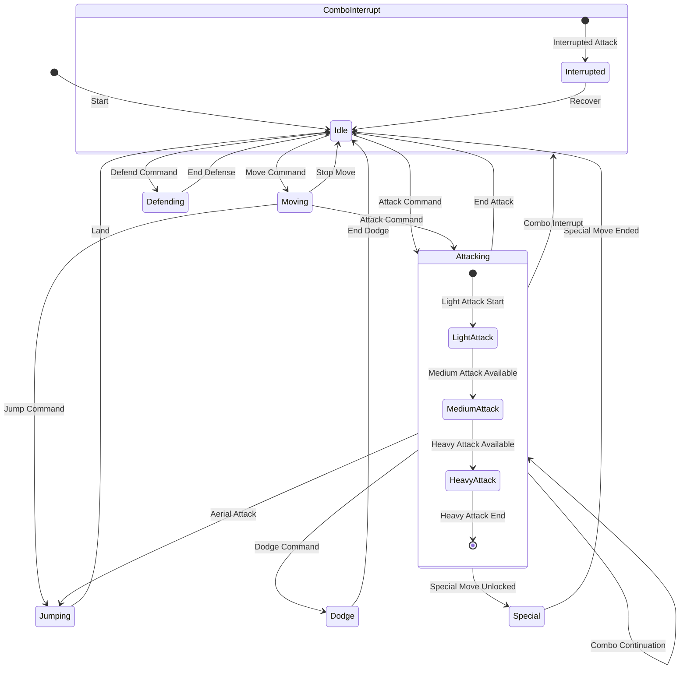
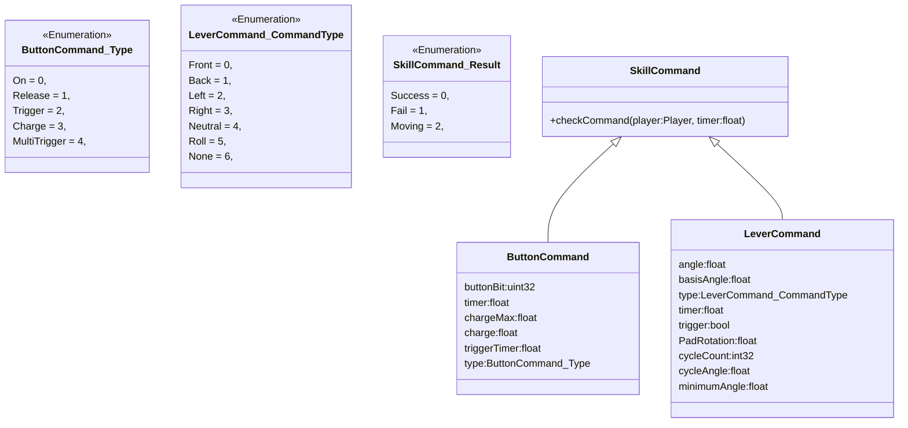
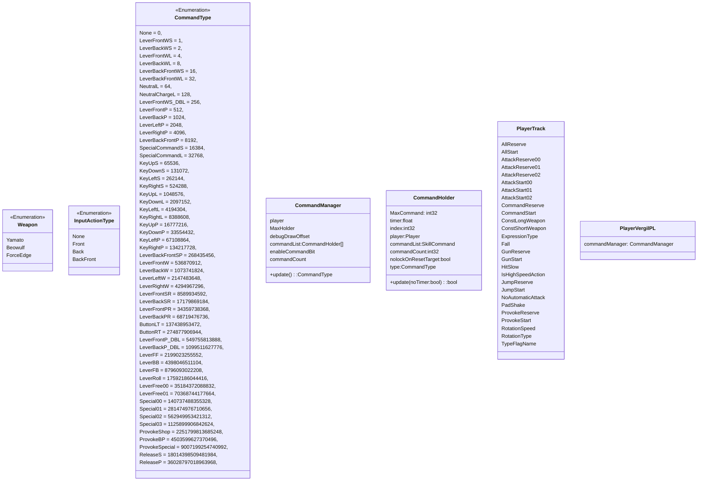

.text:00007FF61957D5A0 ; __int64 __fastcall re_loadMotlist_mtre(via::motion::tree::_mtre::_MotlistData *a1, __int64 a2)

JudgeMentCut
    JudgeMentCutCharge:app.ChargeChecker
    

``` mermaid

stateDiagram-v2
    [*] --> Idle: Start
    Idle --> Moving: Move Command
    Moving --> Idle: Stop Move
    Moving --> Jumping: Jump Command
    Jumping --> Idle: Land
    Idle --> Attacking: Attack Command
    Moving --> Attacking: Attack Command

    Attacking --> Attacking: Combo Continuation
    Attacking --> Idle: End Attack
    Attacking --> Dodge: Dodge Command
    Attacking --> Jumping: Aerial Attack
    Attacking --> ComboInterrupt: Combo Interrupt

    Idle --> Defending: Defend Command
    Defending --> Idle: End Defense

    Attacking --> Special: Special Move Unlocked
    Special --> Idle: Special Move Ended

    Dodge --> Idle: End Dodge

    state Attacking {
        [*] --> LightAttack: Light Attack Start
        LightAttack --> MediumAttack: Medium Attack Available
        MediumAttack --> HeavyAttack: Heavy Attack Available
        HeavyAttack --> [*]: Heavy Attack End
    }

    state ComboInterrupt {
        [*] --> Interrupted: Interrupted Attack
        Interrupted --> Idle: Recover
    }

```

```mermaid
classDiagram

class ButtonCommand_Type {
    <<Enumeration>>
    On = 0,
    Release = 1,
    Trigger = 2,
    Charge = 3,
    MultiTrigger = 4,
}

class LeverCommand_CommandType {
    <<Enumeration>>
    Front = 0,
        Back = 1,
        Left = 2,
        Right = 3,
        Neutral = 4,
        Roll = 5,
        None = 6,
}

class SkillCommand_Result {
    <<Enumeration>>
    Success = 0,
    Fail = 1,
    Moving = 2,
}

class SkillCommand{
    +checkCommand(player:Player, timer:float)
}

SkillCommand <|-- ButtonCommand
SkillCommand <|-- LeverCommand

class ButtonCommand{
    buttonBit:uint32
    timer:float
    chargeMax:float
    charge:float
    triggerTimer:float
    type:ButtonCommand_Type
}

class LeverCommand{
    angle:float
    basisAngle:float
    type:LeverCommand_CommandType
    timer:float
    trigger:bool
    PadRotation:float
    cycleCount:int32
    cycleAngle:float
    minimumAngle:float
}
```

```mermaid
classDiagram

class Weapon{
    <<Enumeration>>
    Yamato
    Beowulf
    ForceEdge
}

class InputActionType{
    <<Enumeration>>
    None
    Front
    Back
    BackFront
}
class CommandType{
    <<Enumeration>>
    None = 0,
    LeverFrontWS = 1,
    LeverBackWS = 2,
    LeverFrontWL = 4,
    LeverBackWL = 8,
    LeverBackFrontWS = 16,
    LeverBackFrontWL = 32,
    NeutralL = 64,
    NeutralChargeL = 128,
    LeverFrontWS_DBL = 256,
    LeverFrontP = 512,
    LeverBackP = 1024,
    LeverLeftP = 2048,
    LeverRightP = 4096,
    LeverBackFrontP = 8192,
    SpecialCommandS = 16384,
    SpecialCommandL = 32768,
    KeyUpS = 65536,
    KeyDownS = 131072,
    KeyLeftS = 262144,
    KeyRightS = 524288,
    KeyUpL = 1048576,
    KeyDownL = 2097152,
    KeyLeftL = 4194304,
    KeyRightL = 8388608,
    KeyUpP = 16777216,
    KeyDownP = 33554432,
    KeyLeftP = 67108864,
    KeyRightP = 134217728,
    LeverBackFrontSP = 268435456,
    LeverFrontW = 536870912,
    LeverBackW = 1073741824,
    LeverLeftW = 2147483648,
    LeverRightW = 4294967296,
    LeverFrontSR = 8589934592,
    LeverBackSR = 17179869184,
    LeverFrontPR = 34359738368,
    LeverBackPR = 68719476736,
    ButtonLT = 137438953472,
    ButtonRT = 274877906944,
    LeverFrontP_DBL = 549755813888,
    LeverBackP_DBL = 1099511627776,
    LeverFF = 2199023255552,
    LeverBB = 4398046511104,
    LeverFB = 8796093022208,
    LeverRoll = 17592186044416,
    LeverFree00 = 35184372088832,
    LeverFree01 = 70368744177664,
    Special00 = 140737488355328,
    Special01 = 281474976710656,
    Special02 = 562949953421312,
    Special03 = 1125899906842624,
    ProvokeShop = 2251799813685248,
    ProvokeBP = 4503599627370496,
    ProvokeSpecial = 9007199254740992,
    ReleaseS = 18014398509481984,
    ReleaseP = 36028797018963968,
}


class CommandManager{
    player
    MaxHolder
    debugDrawOffset
    commandList:CommandHolder[]
    enableCommandBit
    commandCount
    +update():CommandType
}

class CommandHolder{
    MaxCommand: int32
    timer:float
    index:int32
    player:Player
    commandList:SkillCommand
    commandCount:int32
    nolockOnResetTarget:bool
    type:CommandType
    
    +update(noTimer:bool):bool
}

class PlayerTrack{
    AllReserve
    AllStart
    AttackReserve00
    AttackReserve01
    AttackReserve02
    AttackStart00
    AttackStart01
    AttackStart02
    CommandReserve
    CommandStart
    ConstLongWeapon
    ConstShortWeapon
    ExpressionType
    Fall
    GunReserve
    GunStart
    HitSlow
    IsHighSpeedAction
    JumpReserve
    JumpStart
    NoAutomaticAttack
    PadShake
    ProvokeReserve
    ProvokeStart
    RotationSpeed
    RotationType
    TypeFlagName
}

class PlayerVergilPL{
    commandManager: CommandManager
}

```
